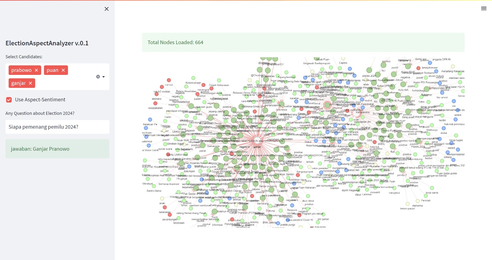
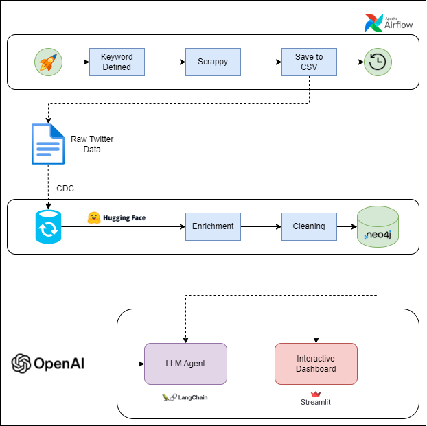

# ElectionAspectAnalyzer
Indonesian-AI Final Project aimed at providing in-depth insights into the 2024 election through social network analysis and sentiment assessment. We employ Social Network Analysis (SNA) and Aspect-Based Sentiment Analysis (ABSA) techniques to understand public interactions and opinions regarding the election.

<div style="text-align:center">
  
</div>

## TODO's

 - [x] Collecting Dataset
 - [x] Find Open Source Model to Enhance Insight from Dataset
 - [x] Model Integration
 - [x] Dashboard Creation
 - [x] Internal Testing
 - [ ] Write Proper Project Documentation

## How To Use

```
# Incoming...
```

## Project Outcome
Gain a comprehensive understanding of the 2024 election in Indonesia through the use of Social Network Analysis (SNA) and Aspect-Based Sentiment Analysis (ABSA) techniques.

## Impact Outcome

 1. **Understanding Public Aspect regards several Election Candidate**
 2. **Assesing Public Sentiments**
 3. **Proper Information using Interactive QA**

## Features

 - [x] SNA Graph 
 - [x] Interactive QA

## Technique Used

 - Prompting: One Shot Learning.
 - Part-Of-Speech for Aspect Detection.
 - Aspect Pair Classification for Sentiment Detection per Sentence & Aspect.
 - Named Entity Recognition for Person or Organization Recognize in Tweets Comment.

## Tech Stack

 - [OpenAI](https://github.com/openai/openai-python)
 - [Langchain](https://python.langchain.com/docs/get_started/introduction)
 - [Streamlit](https://streamlit.io/)
 - [Streamlit Agraph](https://github.com/ChrisDelClea/streamlit-agraph)

## Contributors

 - [Muhammad Alif Ramadhan](https://github.com/NnA301023)

## Future Improvements

Continue development MVP prorotype into mentioned diagram
<div style="text-align:center">
  
</div>